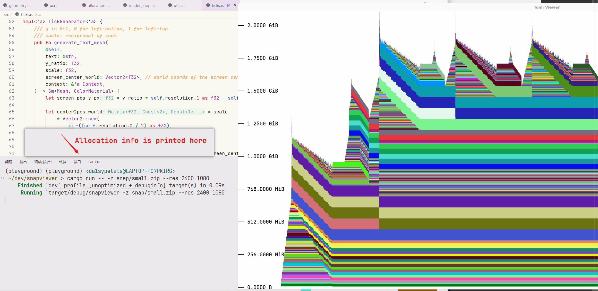

# Snapviewer

A PyTorch memory snapshot viewer alternative to https://docs.pytorch.org/memory_viz. Display large snapshots smoothly! 



## Preprocess
- Record memory snapsnot for your model. You may refer to [documentation](https://docs.pytorch.org/docs/stable/torch_cuda_memory.html);
- Convert the snapshot to zip format with `convert_snap.py`.
```sh
python convert_snap.py -i snap/large.pickle -o snap/large.zip
```

## Use
- See `cargo run -- --help`.
- Navigate with WASD and mouse scroll.
- Left click on the allocation, and its details (size, call stack, etc.) will show in stdout;
- Right click anywhere and (memory the cursor's $y$ coords is at) will show in stdout.


# TODO:
- Embed this in a web page via WASM.

# Notes
Run local for me: 
```sh
cargo run -- -p snap/block8_len100.zip --res 2400 1080 --log-info
```
For very large snapshots, run on release:
```sh
cargo run -r -- -p snap/large.zip --res 2400 1080 --log-info
```