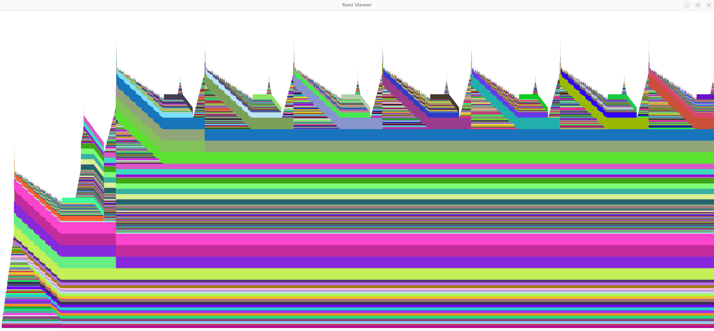

# Snapviewer

Display large snapshots smoother! Navigate with WASD and mouse scroll.

TODO: resolve click
- given a click on the screen: 
  1. compute where the click in world coords
  2. compute which allocation the click is in

TODO: show call stack